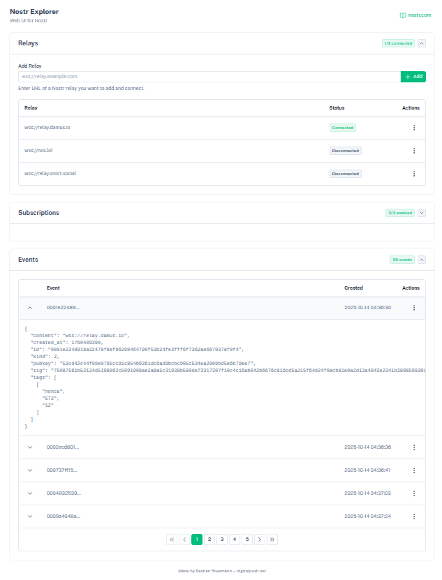

# About
Nostr Explorer is a web browser application to explore the content
of the Nostr network which is based on the [Nostr](https://nostr.com/) protocol:

> Nostr is an apolitical communication commons. A simple standard that defines a scalable architecture of clients and servers that can be used to spread information freely. Not controlled by any corporation or government, anyone can build on Nostr and anyone can use it.

# Developer
This application uses Vue.js, Nuxt and Nuxt UI and has been created by [Bastian Roesmann](https://www.digitalpush.net/).

For development:
```bash
npm install && npm run dev
```

For production:
```bash
npm install && npm run build
```
